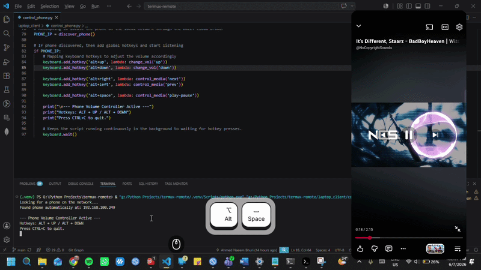

# termux-remote

A lightweight Python setup to control your Android phone from your laptop using global hotkeys.

Set up a tiny Flask server on your phone and a background listener on your PC. Your laptop discovers the phone automatically via `dweet.cc`, then sends secure media commands over Wi-Fi.

---

<p align="center">
  
</p>
---

## 🚀 What It Does

- Finds your phone's local IP automatically using a private `DWEET_ID` channel.
- Sends media and volume commands from your laptop to your phone.
- Executes native Android `cmd media_session` commands on the phone.
- Protects the phone by only allowing safe, whitelisted actions.

---

## 🧠 How It Works

1. **Phone publishes IP:** `android_server/vol_server.py` discovers the phone's current Wi-Fi IP and publishes it to `dweet.cc` under `DWEET_ID`.
2. **Laptop discovers phone:** `laptop_client/control_phone.py` reads the latest IP from the same `DWEET_ID` channel.
3. **Hotkeys send commands:** When you press a hotkey, the laptop script sends an HTTP GET request to the phone.
4. **Phone executes safely:** The phone server validates the command and runs `cmd media_session` only for whitelisted actions.

---

## 📦 Requirements

- Python 3.10+ on both devices
- Termux installed on Android
- Wi-Fi connectivity between phone and laptop
- A shared `.env` value for `DWEET_ID`

---

## ⚙️ Setup

### 1. Phone Setup (Termux)

1. Open Termux.
2. Install Python and nano:

```bash
pkg install python nano
```

3. Install required Python packages:

```bash
pip install flask requests python-dotenv
```

4. Place `android_server/vol_server.py` somewhere in Termux storage.
5. Create a `.env` file in the same folder:

```bash
nano .env
```

6. Add this line, replacing the value with a private channel name:

```env
DWEET_ID=your_own_secret_unique_string_here
```

7. Start the phone server:

```bash
python vol_server.py
```

The phone will publish its local IP automatically and start listening on port `5000`.

### 2. Laptop Setup

1. Install the required Python packages:

```bash
pip install keyboard requests python-dotenv
```

2. Copy `laptop_client/control_phone.py` to your laptop project folder.
3. Create an identical `.env` file in the laptop folder:

```bash
nano .env
```

4. Use the same `DWEET_ID` value as the phone:

```env
DWEET_ID=your_own_secret_unique_string_here
```

5. Run the laptop listener:

```bash
python laptop_client/control_phone.py
```

---

## 🎹 Hotkeys

Once both scripts are running, use these global hotkeys on your laptop:

- `ALT + UP` → increase phone volume
- `ALT + DOWN` → decrease phone volume
- `ALT + RIGHT` → next track
- `ALT + LEFT` → previous track
- `ALT + SPACE` → play/pause toggle

---

## 🔒 Security

The Android server enforces a strict whitelist for commands.

Allowed media commands:

```python
media_dispatch_keys = ["next", "previous", "play", "pause", "play-pause", "stop", "mute"]
```

Allowed volume commands:

```python
volume_keys = ["raise", "lower", "same"]
```

Any invalid command returns HTTP `400 Bad Request` and is ignored.

---

## 🛠️ Troubleshooting

- If the laptop cannot find the phone:
  - Ensure the phone server is running.
  - Check the same `DWEET_ID` value is set on both devices.
  - Confirm both devices are on the same Wi-Fi network.

- If the hotkeys do not work on Windows:
  - Run the script with administrator privileges.
  - Make sure the `keyboard` package is installed correctly.

- If commands fail after the phone changes networks:
  - Restart `vol_server.py` on the phone.
  - Restart `control_phone.py` on the laptop.

---

## 📁 Project Structure

- `android_server/vol_server.py` — Flask API for Android phone control.
- `laptop_client/control_phone.py` — Laptop hotkey listener and dweet discovery.
- `README.MD` — This guide.

---

## 💡 Notes

- This project is designed to be minimal and easy to extend.
- If you want to add new actions, update the whitelist in `vol_server.py` and add matching hotkeys in `control_phone.py`.
- Keep your `DWEET_ID` private to avoid exposing your device discovery channel.
